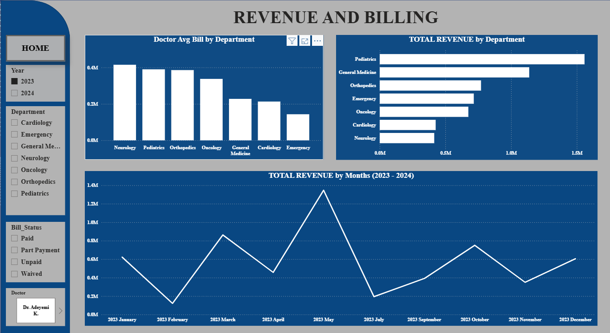

# 🏥 Hospital Performance Analysis
**Tools:** Power BI · Power Query · DAX · Microsoft Excel  
**Period Covered:** January 2023 – December 2024  
**Status:** Complete ✅

---

## 📌 Project Overview

This project is a full end-to-end data analysis of hospital operational and financial performance data. The analysis was commissioned to address five critical problems identified by hospital leadership — the CFO and Medical Director — including declining revenue per patient, rising outstanding bills, data integrity issues, inconsistent department records, and uneven doctor workload distribution.

The deliverables include a six-page interactive Power BI dashboard and a full written performance report with findings and recommendations.

---

## ❗ Business Problems Addressed

| # | Problem | Stakeholder |
|---|---------|-------------|
| 1 | Revenue per patient appears to be declining despite patient growth | CFO |
| 2 | Unpaid and part-payment bills are increasing — root cause unknown | Finance Team |
| 3 | Department heads reporting different patient volumes than the system | Operations |
| 4 | Department names recorded inconsistently — cross-department comparison impossible | All |
| 5 | Doctor workload distribution cannot be accurately assessed due to data quality issues | Medical Director |

---

## 🧹 Data Cleaning Process

Cleaning was performed in **Microsoft Power Query** using a **flag-first approach** — issues were flagged before removal to ensure transparency and auditability.

**7 data quality issues resolved:**

- ✅ Inconsistent department names → standardised using Replace Values
- ✅ Invalid ages (outside 1–110 range) → removed using Number Filters
- ✅ Missing values → handled per column context
- ✅ Duplicate records → detected and removed
- ✅ Negative bill amounts → flagged with custom column before removal
- ✅ Mixed date formats → standardised across dataset
- ✅ Inconsistent diagnosis names → cleaned using Replace Values

---

## 📊 Key Metrics (Post-Cleaning)

| Metric | Value |
|--------|-------|
| Total Patients | 924 |
| Total Revenue | ₦229.29 Million |
| Average Bill per Patient | ₦248,150 |
| Outstanding Bill Rate | 22.73% |
| Total Doctors | 21 |
| Period | Jan 2023 – Dec 2024 |

---

## 🔍 Key Findings

### Patient Volume
- **General Medicine** recorded the highest patient admissions across both years
- **Cardiology** recorded the lowest patient volume
- Overall volume grew from **454 (2023) → 470 (2024)**
- Consistent **April/May spike** and **July dip** observed across both years

### Revenue & Billing
- **General Medicine** generated the highest revenue (~₦40M)
- Revenue trend mirrors patient volume — peaks in April/May, dips in July both years
- Month-to-month fluctuation suggests seasonal or operational drivers

### Insurance & Outstanding Bills
- **73.92%** of patients were insured across 5 insurance companies
- **16.88%** Private Pay | **9.2%** Uninsured
- Outstanding bill rate: **22.73%** — nearly 1 in 4 patients have unpaid/part-payment bills
- 🔑 **Key insight:** Insured patients account for **159 unpaid bills** vs only **20 for uninsured** — the problem is a **collections process gap, not patient affordability**
- **Cardiology** and **Emergency** recorded the highest outstanding bill rates

### Length of Stay
- **Pediatrics** had the longest average length of stay
- **Cardiology** had the shortest
- Extended Stay patients generate the highest total revenue

### Doctor Performance
- **Dr. Usman D.** carried the highest patient load (~58 patients)
- **Dr. Danjuma F.** recorded the highest average bill per patient
- Notable billing variance exists across doctors within the same department

---

## 💡 Recommendations

1. **Billing & Collections** — Introduce a structured follow-up process for unpaid bills, prioritising Cardiology and Emergency departments. Review insurance reimbursement process — insurance coverage is not translating to bill collection.

2. **Revenue Investigation** — CFO to investigate the consistent April/May spike and July dip pattern across both years — likely seasonal or operational.

3. **Doctor Billing Standardisation** — Introduce per-department billing guidelines to reduce variance, particularly given the gap between Dr. Danjuma F. and lower-billing peers.

4. **Data Governance** — Implement standardised data entry protocols for department names and diagnosis records to prevent recurrence of cleaning issues.

---

## 📁 Repository Contents

```
hospital-performance-analysis/
│
├── README.md                          ← You are here
├── Hospital_Dirty_Data.xlsx           ← Raw dataset (intentionally dirty)
├── HOSPITAL_PERFORMANCE_ANALYSIS.docx ← Full written report
└── images/
    ├── Home Page.png                  ← Dashboard: Overview page
    ├── Patient Volume.png             ← Dashboard: Patient Volume page
    ├── Revenue.png                    ← Dashboard: Revenue & Billing page
    ├── insurance and outstanding bill.png ← Dashboard: Insurance & Outstanding Bills
    ├── Length of Stay.png             ← Dashboard: Length of Stay page
    └── Doctor Performance.png         ← Dashboard: Doctor Performance page
```

---

## 🛠️ Tools & Technologies

| Tool | Purpose |
|------|---------|
| Microsoft Excel | Raw data storage |
| Power Query (M Language) | Data cleaning & transformation |
| Microsoft Power BI | Dashboard development & visualisation |
| DAX | Calculated measures & KPIs |
| Microsoft Word | Written report & recommendations |

---

## 🔗 Links

- 📊 [View Full Project on Google Drive](https://drive.google.com/drive/folders/1UVLfF2-TyaGqaPzjSO13oglnIriA3EuX?usp=drive_link)
- 🌐 [Portfolio Website](https://oluwadamilare-sulemana.github.io)

---

*Project by [Oluwadamilare Sulemana](https://www.linkedin.com/in/sulemana-oluwadamilare-16a243284) — Data Analyst | Lagos, Nigeria*

---

### Dashboard Screenshots





